# 🏗️ Arquitectura de la Plataforma de Reservas de Propiedades

## Diagrama de Arquitectura Completo

```mermaid
graph TB
    subgraph external["🌐 Servicios Externos"]
        GoogleOAuth["🔐 Google OAuth 2.0<br/>OpenID Connect"]
        DockerHub["🐋 Docker Hub<br/>Registry de Imágenes"]
    end

    subgraph users["👥 Usuarios"]
        Cliente["👤 Usuarios/Clientes<br/>Web Browser"]
    end

    subgraph frontend["Frontend Layer"]
        direction TB
        Nginx["🔀 Nginx<br/>Puerto 80<br/>Reverse Proxy"]

        subgraph pages["Páginas HTML Estáticas"]
            Index["📄 index.html<br/>Landing Page"]
            Detalle["🏠 detalle.html<br/>Detalles Propiedad"]
            Reserva["📅 reserva.html<br/>Sistema de Reservas"]
            MisReservas["📋 mis-reservas.html<br/>Historial Usuario"]
            Feedback["⭐ feedback.html<br/>Opiniones"]
            Admin["⚙️ admin-panel.html<br/>Panel Admin"]
        end

        subgraph static["Assets Estáticos"]
            CSS["🎨 styles.css<br/>TailwindCSS"]
            JS["📜 api.js<br/>Fetch API Client"]
        end
    end

    subgraph backend["Backend Layer - FastAPI"]
        direction TB
        APIServer["⚡ FastAPI Server<br/>Python 3.11<br/>Puerto 8000<br/>Uvicorn ASGI"]

        subgraph modules["Módulos de Negocio"]
            AuthModule["🔑 Auth Module<br/>Login/Register<br/>Sessions"]
            BookingModule["📅 Booking Module<br/>Gestión Reservas<br/>Validaciones"]
            PropertiesModule["🏘️ Properties Module<br/>Catálogo<br/>Seed Data"]
            FeedbackModule["💬 Feedback Module<br/>Comentarios<br/>Ratings"]
            BackgroundTasks["⏰ Background Tasks<br/>Actualización automática<br/>Estado de reservas"]
        end

        subgraph endpoints["REST API Endpoints"]
            AuthAPI["/api/register<br/>/api/login<br/>/auth/google/*"]
            BookingAPI["/api/reserve<br/>/api/reserved-dates<br/>/api/active-reservations<br/>/api/cancel-reservation"]
            PropertiesAPI["/api/properties<br/>/api/property/:id"]
            FeedbackAPI["/api/feedback<br/>/api/feedback/:id"]
            MetricsAPI["/metrics<br/>Prometheus Metrics"]
        end

        subgraph orm["ORM & Data Access"]
            SQLAlchemy["🗃️ SQLAlchemy<br/>ORM Engine<br/>Connection Pool"]
        end
    end

    subgraph data["Data Layer"]
        direction TB
        subgraph postgres_cluster["PostgreSQL Production"]
            PostgresProd["🐘 PostgreSQL 15<br/>Database Server<br/>Puerto 5432"]
            PGVolume["💾 Persistent Volume<br/>2Gi Storage<br/>booking_app_db"]
        end

        SQLiteDev["📦 SQLite<br/>app.db<br/>Desarrollo Local"]
    end

    subgraph observability["📊 Observability & Monitoring"]
        direction TB
        Prometheus["📈 Prometheus<br/>Metrics Server<br/>Puerto 9090<br/>Scrape Interval: 15s"]
        Grafana["📊 Grafana<br/>Dashboards<br/>Puerto 3000<br/>Admin UI"]

        subgraph custom_metrics["Métricas Personalizadas"]
            MetricReservations["📊 booking_reservations_total<br/>Counter: Success/Conflict/Invalid"]
            MetricCancellations["📊 booking_cancellations_total<br/>Counter: Success/Too Late"]
            MetricNights["📊 booking_reservation_nights<br/>Histogram: Distribución noches"]
            MetricDBHealth["📊 booking_database_up<br/>Gauge: Estado DB (0/1)"]
        end

        Dashboard["📋 FastAPI - Observabilidad<br/>Dashboard Pre-provisionado"]
    end

    subgraph infra["🏗️ Infraestructura"]
        direction TB

        subgraph docker_local["Docker Compose - Desarrollo Local"]
            ComposeFile["📄 docker-compose.yml<br/>5 Servicios:<br/>• backend<br/>• frontend<br/>• db<br/>• prometheus<br/>• grafana"]
            ComposeVolumes["💾 Volumes:<br/>• postgres_data<br/>• prometheus_data<br/>• grafana_data"]
        end

        subgraph kubernetes["☸️ Kubernetes / Minikube"]
            direction TB

            subgraph deployments["Deployments & StatefulSets"]
                K8sFrontend["🚀 Frontend Deployment<br/>Replicas: 1<br/>Image: airbnb-frontend:v1.1<br/>RollingUpdate"]
                K8sBackend["🚀 Backend Deployment<br/>Replicas: 1<br/>Image: airbnb-backend:v1.1<br/>Init Container: wait-for-db"]
                K8sPostgres["🚀 PostgreSQL StatefulSet<br/>Replicas: 1<br/>postgres:15-alpine<br/>Persistent Volume Claim"]
            end

            subgraph services["Services"]
                SvcFrontend["🔌 frontend-service<br/>NodePort: 30080<br/>Target: 80"]
                SvcBackend["🔌 backend-service<br/>ClusterIP<br/>Port: 8000<br/>Annotations: prometheus.io/*"]
                SvcPostgres["🔌 postgres-service<br/>Headless Service<br/>Port: 5432"]
            end

            subgraph config["Configuración K8s"]
                ConfigMap["⚙️ ConfigMap<br/>airbnb-config<br/>• POSTGRES_DB<br/>• POSTGRES_USER<br/>• POSTGRES_HOST"]
                Secrets["🔒 Secrets<br/>airbnb-secret<br/>• POSTGRES_PASSWORD<br/>• GOOGLE_CLIENT_ID<br/>• GOOGLE_CLIENT_SECRET"]
            end

            subgraph probes["Health Checks"]
                Liveness["❤️ Liveness Probes<br/>TCP Socket / pg_isready"]
                Readiness["✅ Readiness Probes<br/>Disponibilidad servicio"]
            end
        end
    end

    subgraph cicd["🔄 CI/CD Pipeline"]
        direction LR
        GitHubActions["⚙️ GitHub Actions<br/>Workflow: build.yml<br/>Trigger: push to main"]
        BuildTest["🧪 Build & Test<br/>pytest<br/>SQLite en CI"]
        DockerBuild["🐋 Docker Build<br/>Multi-stage builds<br/>Backend + Frontend"]
        DockerPush["📤 Docker Push<br/>Tags: latest, v1.x<br/>→ Docker Hub"]
    end

    %% ==================== RELACIONES ====================

    %% Usuarios -> Frontend
    Cliente -->|"HTTPS<br/>Web Browser"| Nginx

    %% Frontend -> Páginas
    Nginx -.->|"Sirve archivos estáticos"| Index
    Nginx -.->|"Sirve archivos estáticos"| Detalle
    Nginx -.->|"Sirve archivos estáticos"| Reserva
    Nginx -.->|"Sirve archivos estáticos"| MisReservas
    Nginx -.->|"Sirve archivos estáticos"| Feedback
    Nginx -.->|"Sirve archivos estáticos"| Admin
    Nginx -.->|"Sirve /estilos"| CSS
    Nginx -.->|"Sirve /estilos"| JS

    %% Frontend -> Backend
    Nginx -->|"Proxy /api/*<br/>Proxy /auth/*"| APIServer

    %% Backend -> Módulos
    APIServer --> AuthModule
    APIServer --> BookingModule
    APIServer --> PropertiesModule
    APIServer --> FeedbackModule
    APIServer -->|"Async Background"| BackgroundTasks

    %% Módulos -> Endpoints
    AuthModule --> AuthAPI
    BookingModule --> BookingAPI
    PropertiesModule --> PropertiesAPI
    FeedbackModule --> FeedbackAPI
    APIServer --> MetricsAPI

    %% Backend -> ORM -> Database
    AuthModule --> SQLAlchemy
    BookingModule --> SQLAlchemy
    PropertiesModule --> SQLAlchemy
    FeedbackModule --> SQLAlchemy
    BackgroundTasks --> SQLAlchemy

    SQLAlchemy -->|"postgresql://<br/>Connection Pool<br/>Async Engine"| PostgresProd
    PostgresProd -->|"Persistencia"| PGVolume
    SQLAlchemy -.->|"sqlite://<br/>Local Dev"| SQLiteDev

    %% OAuth
    AuthModule -->|"OAuth 2.0 Flow<br/>OpenID Connect"| GoogleOAuth

    %% Observability
    Prometheus -->|"Scrape /metrics<br/>Cada 15s"| MetricsAPI
    MetricsAPI --> MetricReservations
    MetricsAPI --> MetricCancellations
    MetricsAPI --> MetricNights
    MetricsAPI --> MetricDBHealth

    Grafana -->|"Query PromQL<br/>Datasource"| Prometheus
    Grafana --> Dashboard
    Cliente -.->|"Visualiza dashboards"| Grafana

    %% Docker Compose
    ComposeFile -.->|"Orquesta servicios"| Nginx
    ComposeFile -.->|"Orquesta servicios"| APIServer
    ComposeFile -.->|"Orquesta servicios"| PostgresProd
    ComposeFile -.->|"Orquesta servicios"| Prometheus
    ComposeFile -.->|"Orquesta servicios"| Grafana
    ComposeFile --> ComposeVolumes

    %% Kubernetes
    K8sFrontend --> SvcFrontend
    K8sBackend --> SvcBackend
    K8sPostgres --> SvcPostgres

    SvcFrontend -.->|"Route traffic"| Nginx
    SvcBackend -.->|"Route traffic"| APIServer
    SvcPostgres -.->|"Route traffic"| PostgresProd

    K8sFrontend -.->|"Lee variables"| ConfigMap
    K8sBackend -.->|"Lee variables"| ConfigMap
    K8sPostgres -.->|"Lee variables"| ConfigMap

    K8sBackend -.->|"Lee secretos"| Secrets
    K8sPostgres -.->|"Lee secretos"| Secrets

    K8sFrontend -.-> Liveness
    K8sBackend -.-> Liveness
    K8sPostgres -.-> Liveness

    K8sFrontend -.-> Readiness
    K8sBackend -.-> Readiness
    K8sPostgres -.-> Readiness

    %% CI/CD
    GitHubActions -->|"1. Run tests"| BuildTest
    BuildTest -->|"2. Build images"| DockerBuild
    DockerBuild -->|"3. Push to registry"| DockerPush
    DockerPush --> DockerHub

    DockerHub -.->|"Pull images<br/>docker pull"| ComposeFile
    DockerHub -.->|"Pull images<br/>imagePullPolicy: Always"| K8sFrontend
    DockerHub -.->|"Pull images<br/>imagePullPolicy: Always"| K8sBackend

    %% Estilos
    classDef frontend_style fill:#4A90E2,stroke:#2E5C8A,stroke-width:2px,color:#fff
    classDef backend_style fill:#50C878,stroke:#2E7D4E,stroke-width:2px,color:#fff
    classDef data_style fill:#9B59B6,stroke:#6C3483,stroke-width:2px,color:#fff
    classDef observability_style fill:#E67E22,stroke:#A04000,stroke-width:2px,color:#fff
    classDef infra_style fill:#34495E,stroke:#1C2833,stroke-width:2px,color:#fff
    classDef external_style fill:#E74C3C,stroke:#922B21,stroke-width:2px,color:#fff

    class Nginx,Index,Detalle,Reserva,MisReservas,Feedback,Admin,CSS,JS frontend_style
    class APIServer,AuthModule,BookingModule,PropertiesModule,FeedbackModule,BackgroundTasks,SQLAlchemy backend_style
    class PostgresProd,PGVolume,SQLiteDev data_style
    class Prometheus,Grafana,Dashboard observability_style
    class K8sFrontend,K8sBackend,K8sPostgres,ComposeFile infra_style
    class GoogleOAuth,DockerHub external_style
```

---

## 📋 Descripción de Componentes

### 🎨 Frontend Layer
- **Nginx**: Servidor web que actúa como reverse proxy y sirve archivos estáticos
- **Páginas HTML**: 6 vistas principales construidas con TailwindCSS
- **Assets**: Estilos CSS y cliente JavaScript para consumir la API

### ⚡ Backend Layer
- **FastAPI Server**: Framework web moderno con soporte async/await
- **Módulos de Negocio**:
  - **Auth Module**: Gestión de autenticación (tradicional + OAuth)
  - **Booking Module**: Lógica de reservas con validaciones de solapamiento
  - **Properties Module**: Catálogo de propiedades con seed automático
  - **Feedback Module**: Sistema de comentarios y ratings
  - **Background Tasks**: Actualización automática de estados de reservas
- **SQLAlchemy ORM**: Capa de abstracción para acceso a datos

### 🗄️ Data Layer
- **PostgreSQL 15**: Base de datos relacional en producción
- **SQLite**: Base de datos para desarrollo local
- **Persistent Volumes**: Almacenamiento persistente en Kubernetes

### 📊 Observability
- **Prometheus**: Sistema de métricas y monitoreo con scraping cada 15s
- **Grafana**: Plataforma de visualización con dashboards pre-configurados
- **Métricas Personalizadas**:
  - `booking_reservations_total`: Contador de intentos de reserva por resultado
  - `booking_cancellations_total`: Contador de cancelaciones
  - `booking_reservation_nights`: Histograma de distribución de noches
  - `booking_database_up`: Gauge de estado de conexión a BD

### 🏗️ Infraestructura

#### Docker Compose (Desarrollo Local)
- Orquestación de 5 servicios: backend, frontend, db, prometheus, grafana
- 3 volúmenes persistentes para datos
- Network compartida para comunicación inter-servicios

#### Kubernetes / Minikube (Producción)
- **Deployments**: Backend y Frontend con estrategia RollingUpdate
- **StatefulSet**: PostgreSQL con almacenamiento persistente
- **Services**:
  - Frontend: NodePort (30080) para acceso externo
  - Backend: ClusterIP con anotaciones Prometheus
  - Postgres: Headless service para StatefulSet
- **ConfigMap**: Variables de configuración no sensibles
- **Secrets**: Credenciales encriptadas (passwords, OAuth keys)
- **Health Checks**: Liveness y Readiness probes en todos los pods
- **Init Containers**: Espera a que PostgreSQL esté disponible antes de iniciar backend

### 🔄 CI/CD Pipeline
- **GitHub Actions**: Workflow automatizado en push a main
- **Etapas**:
  1. **Build & Test**: Ejecución de pytest con SQLite
  2. **Docker Build**: Construcción de imágenes backend y frontend
  3. **Docker Push**: Publicación a Docker Hub con tags latest y versionado
- **Imágenes públicas**:
  - `julilyherrera/airbnb-backend:latest`
  - `julilyherrera/airbnb-frontend:latest`

### 🌐 Servicios Externos
- **Google OAuth 2.0**: Autenticación social con OpenID Connect
- **Docker Hub**: Registry público para imágenes de contenedor

---

## 🔐 Seguridad

- **Secrets Management**: Credenciales almacenadas en Kubernetes Secrets
- **OAuth 2.0**: Flujo de autenticación estándar de la industria
- **CORS**: Configuración de orígenes permitidos
- **Session Management**: Middleware de sesiones con secret key
- **Environment Variables**: Configuración sensible via variables de entorno

---

## 📈 Flujo de Datos

### Flujo de Reserva
1. Usuario accede a `reserva.html` via Nginx
2. JavaScript hace fetch a `/api/reserve`
3. Nginx proxy al FastAPI backend
4. Booking Module valida:
   - Fechas futuras
   - No solapamiento con reservas existentes
   - Formato de datos
5. SQLAlchemy persiste en PostgreSQL
6. Métricas actualizadas en Prometheus
7. Respuesta JSON al cliente
8. Dashboard de Grafana muestra estadísticas en tiempo real

### Flujo OAuth
1. Usuario hace clic en "Login con Google"
2. Redirect a `/auth/google`
3. Backend inicia flujo OAuth con Google
4. Usuario autoriza en Google
5. Callback a `/auth/google/callback`
6. Backend valida token y crea/recupera usuario
7. Sesión establecida, redirect al frontend

---

## 🚀 Escalabilidad

- **Horizontal Scaling**: Backend puede escalar a múltiples réplicas
- **Connection Pooling**: SQLAlchemy maneja pool de conexiones
- **Async I/O**: FastAPI con Uvicorn permite alta concurrencia
- **StatefulSet**: PostgreSQL con persistencia y alta disponibilidad
- **Caching**: Nginx puede cachear assets estáticos
- **Load Balancing**: Kubernetes Services distribuyen tráfico

---

## 📦 Tecnologías Utilizadas

| Categoría | Tecnología | Versión |
|-----------|-----------|---------|
| **Backend** | Python | 3.11 |
| **Framework** | FastAPI | - |
| **Server** | Uvicorn | - |
| **ORM** | SQLAlchemy | - |
| **Database** | PostgreSQL | 15 |
| **Frontend Server** | Nginx | - |
| **Styling** | TailwindCSS | - |
| **Monitoring** | Prometheus | v2.52.0 |
| **Visualization** | Grafana | v11.1.0 |
| **Orchestration** | Kubernetes/Minikube | - |
| **Containerization** | Docker | - |
| **CI/CD** | GitHub Actions | - |
| **Auth** | Authlib (OAuth) | - |

---

## 🔗 Referencias

- **Repositorio**: [JULILYHERRERA/AIRBNB_GESTION](https://github.com/JULILYHERRERA/AIRBNB_GESTION)
- **Docker Hub**: [julilyherrera](https://hub.docker.com/repositories/eritzsm)
- **Documentación FastAPI**: https://fastapi.tiangolo.com
- **Prometheus**: https://prometheus.io
- **Grafana**: https://grafana.com

---

**Última actualización**: 2025-11-11
**Versión de la arquitectura**: 1.1
