# 🔄 Flujos de Arquitectura - Diagramas de Secuencia

## Diagrama de Secuencia - Flujo de Reserva

```mermaid
sequenceDiagram
    actor Usuario
    participant Browser
    participant Nginx
    participant FastAPI
    participant BookingModule
    participant SQLAlchemy
    participant PostgreSQL
    participant Prometheus

    Usuario->>Browser: Completa formulario de reserva
    Browser->>Nginx: POST /api/reserve
    Nginx->>FastAPI: Forward request
    FastAPI->>BookingModule: Procesar reserva

    BookingModule->>SQLAlchemy: Validar fechas disponibles
    SQLAlchemy->>PostgreSQL: SELECT * FROM reservations WHERE...
    PostgreSQL-->>SQLAlchemy: Resultados
    SQLAlchemy-->>BookingModule: Fechas validadas

    alt Fechas disponibles
        BookingModule->>SQLAlchemy: INSERT nueva reserva
        SQLAlchemy->>PostgreSQL: INSERT INTO reservations
        PostgreSQL-->>SQLAlchemy: Confirmación
        BookingModule->>Prometheus: booking_reservations_total{outcome="success"} ++
        BookingModule-->>FastAPI: Reserva exitosa
        FastAPI-->>Nginx: 200 OK + datos reserva
        Nginx-->>Browser: JSON response
        Browser-->>Usuario: Confirmación visual
    else Fechas no disponibles
        BookingModule->>Prometheus: booking_reservations_total{outcome="conflict"} ++
        BookingModule-->>FastAPI: Error solapamiento
        FastAPI-->>Nginx: 409 Conflict
        Nginx-->>Browser: Error message
        Browser-->>Usuario: Mensaje de error
    end
```



---

## Diagrama de Secuencia - Autenticación OAuth con Google


---

## Diagrama de Secuencia - Monitoreo y Observabilidad

```mermaid
sequenceDiagram
    participant Prometheus
    participant FastAPI
    participant BackgroundTask
    participant PostgreSQL
    participant Grafana
    actor DevOps

    loop Cada 15 segundos
        Prometheus->>FastAPI: GET /metrics
        FastAPI-->>Prometheus: Métricas en formato Prometheus
        Note over Prometheus: Almacena en TSDB
    end

    loop Cada 30 segundos
        BackgroundTask->>PostgreSQL: SELECT pg_isready()
        alt Database UP
            PostgreSQL-->>BackgroundTask: Connection OK
            BackgroundTask->>FastAPI: booking_database_up = 1
        else Database DOWN
            PostgreSQL-->>BackgroundTask: Connection failed
            BackgroundTask->>FastAPI: booking_database_up = 0
        end
    end

    DevOps->>Grafana: Accede dashboard
    Grafana->>Prometheus: Query PromQL
    Prometheus-->>Grafana: Time series data
    Grafana-->>DevOps: Dashboard visualizado

    Note over DevOps,Grafana: Ejemplo: rate(booking_reservations_total[5m])
```



---

## Diagrama de Flujo - Proceso de Deployment

```mermaid
graph TD
    Start([Developer hace Push a main]) --> GitHubActions[GitHub Actions Triggered]

    GitHubActions --> Checkout[Checkout Repository]
    Checkout --> SetupPython[Setup Python 3.11]

    SetupPython --> InstallDeps[Install Dependencies]
    InstallDeps --> RunTests{Run pytest}

    RunTests -->|Tests Pass| BuildBackend[Build Backend Image]
    RunTests -->|Tests Fail| FailBuild[❌ Build Failed]

    BuildBackend --> BuildFrontend[Build Frontend Image]
    BuildFrontend --> TagImages[Tag Images<br/>latest + v1.x]

    TagImages --> PushHub[Push to Docker Hub]
    PushHub --> Success[✅ Deployment Success]

    Success --> NotifyDev[Notify Developer]

    FailBuild --> NotifyError[Notify Error]

    style Start fill:#4A90E2
    style Success fill:#50C878
    style FailBuild fill:#E74C3C
    style RunTests fill:#E67E22
```



---

## Diagrama de Estados - Ciclo de Vida de una Reserva

```mermaid
stateDiagram-v2
    [*] --> Pendiente: Usuario crea reserva

    Pendiente --> Confirmada: Pago procesado
    Pendiente --> Cancelada: Usuario cancela
    Pendiente --> Expirada: Timeout sin pago

    Confirmada --> Activa: Fecha check-in llega
    Confirmada --> Cancelada: Cancelación antes check-in

    Activa --> Completada: Fecha check-out alcanzada
    Activa --> Cancelada: Cancelación durante estancia

    Completada --> ConFeedback: Usuario deja review
    Completada --> [*]: Finalizada sin feedback

    ConFeedback --> [*]: Proceso finalizado

    Cancelada --> [*]: Registro histórico
    Expirada --> [*]: Limpieza automática

    note right of Activa
        Background task verifica
        cada 30s si check-out
        fue alcanzado
    end note

    note right of Pendiente
        Validaciones:
        - Sin solapamiento
        - Fechas futuras
        - Propiedad disponible
    end note
```



---

## Diagrama de Red - Topología Kubernetes

```mermaid
graph TB
    subgraph Internet
        Users[👥 Usuarios Internet]
    end

    subgraph "Minikube Node"
        subgraph "Namespace: default"

            subgraph "Ingress Layer"
                Ingress[🔀 Ingress Controller<br/>Optional]
            end

            subgraph "Frontend Tier"
                FrontendPod1[Frontend Pod 1<br/>nginx:latest<br/>Port 80]
                FrontendSvc[Service: frontend-service<br/>NodePort: 30080]
            end

            subgraph "Backend Tier"
                BackendPod1[Backend Pod 1<br/>fastapi:latest<br/>Port 8000]
                BackendSvc[Service: backend-service<br/>ClusterIP: 10.x.x.x<br/>Port: 8000]
            end

            subgraph "Data Tier"
                PostgresPod[PostgreSQL Pod<br/>postgres:15-alpine<br/>Port 5432]
                PVC[PersistentVolumeClaim<br/>2Gi]
                PostgresSvc[Service: postgres-service<br/>Headless Service]
            end

            subgraph "Monitoring Tier"
                PrometheusPod[Prometheus Pod<br/>Port 9090]
                GrafanaPod[Grafana Pod<br/>Port 3000]
            end

        end

        subgraph "Storage"
            PV[PersistentVolume<br/>Host Path / NFS]
        end

    end

    Users -->|HTTP :30080| FrontendSvc
    FrontendSvc --> FrontendPod1
    FrontendPod1 -->|Proxy /api| BackendSvc
    BackendSvc --> BackendPod1
    BackendPod1 -->|postgresql://| PostgresSvc
    PostgresSvc --> PostgresPod
    PostgresPod --> PVC
    PVC --> PV

    PrometheusPod -->|Scrape :8000/metrics| BackendSvc
    GrafanaPod -->|Query :9090| PrometheusPod

    Users -.->|Optional :3000| GrafanaPod

    style Users fill:#4A90E2
    style FrontendPod1 fill:#50C878
    style BackendPod1 fill:#E67E22
    style PostgresPod fill:#9B59B6
    style PrometheusPod fill:#E74C3C
    style GrafanaPod fill:#E74C3C
```



---

## Diagrama de Contexto - C4 Model Level 1

```mermaid
graph TB
    subgraph "Sistema de Reservas de Propiedades"
        System[Plataforma Airbnb Clone<br/>Backend: FastAPI<br/>Frontend: Nginx/HTML<br/>DB: PostgreSQL]
    end

    User[👤 Usuario Final<br/>Busca y reserva propiedades]
    Admin[👤 Administrador<br/>Gestiona propiedades y usuarios]
    DevOps[👤 DevOps Engineer<br/>Monitorea sistema]

    GoogleAuth[🔐 Google OAuth<br/>Proveedor de identidad]
    EmailSvc[📧 Email Service<br/>Notificaciones futuras]
    PaymentGateway[💳 Payment Gateway<br/>Procesamiento pagos futuro]

    User -->|"Busca, reserva,<br/>deja feedback"| System
    Admin -->|"Administra<br/>contenido"| System
    DevOps -->|"Monitorea<br/>métricas"| System

    System -->|"Autentica usuarios<br/>OAuth 2.0"| GoogleAuth
    System -.->|"Envía confirmaciones<br/>(futuro)"| EmailSvc
    System -.->|"Procesa pagos<br/>(futuro)"| PaymentGateway

    style System fill:#4A90E2,stroke:#2E5C8A,stroke-width:4px
    style GoogleAuth fill:#E74C3C
    style EmailSvc fill:#95A5A6
    style PaymentGateway fill:#95A5A6
```



---

## Diagrama de Componentes - C4 Model Level 2


---

## Métricas de Rendimiento Objetivo

| Métrica | Objetivo | Medición |
|---------|----------|----------|
| **Latencia API (p95)** | < 200ms | Prometheus histogram |
| **Throughput** | > 100 req/s | Grafana dashboard |
| **Disponibilidad** | > 99.5% | booking_database_up gauge |
| **Error rate** | < 1% | HTTP 5xx counter |
| **DB Connection Pool** | < 80% utilizado | SQLAlchemy metrics |
| **Pod CPU** | < 70% | Kubernetes metrics |
| **Pod Memory** | < 80% | Kubernetes metrics |

---

## Estrategias de Escalabilidad

### Horizontal Scaling
```yaml
# HPA (Horizontal Pod Autoscaler)
apiVersion: autoscaling/v2
kind: HorizontalPodAutoscaler
metadata:
  name: backend-hpa
spec:
  scaleTargetRef:
    apiVersion: apps/v1
    kind: Deployment
    name: backend
  minReplicas: 2
  maxReplicas: 10
  metrics:
  - type: Resource
    resource:
      name: cpu
      target:
        type: Utilization
        averageUtilization: 70
  - type: Resource
    resource:
      name: memory
      target:
        type: Utilization
        averageUtilization: 80
```

### Caching Strategy


---

**Última actualización**: 2025-11-11
