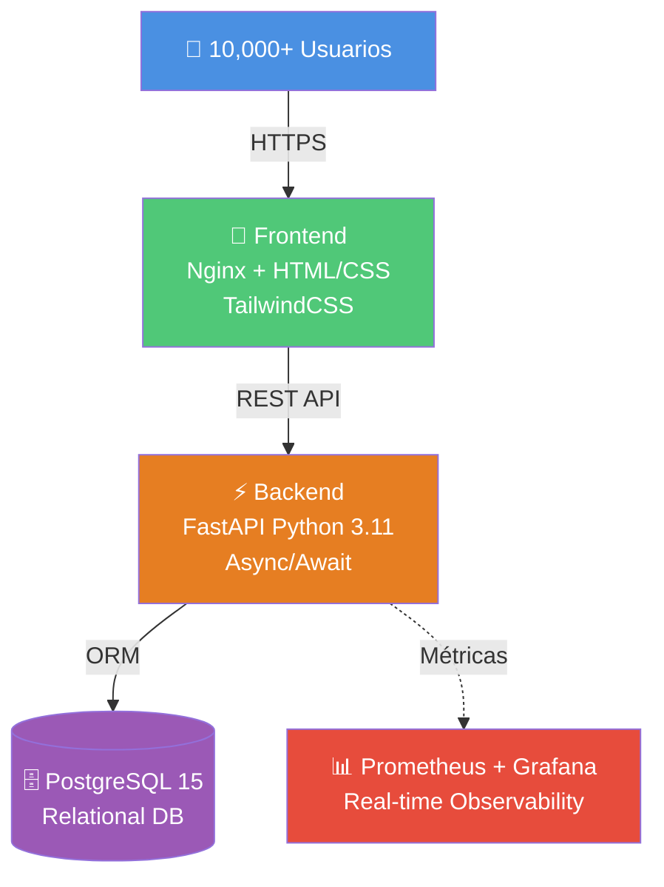
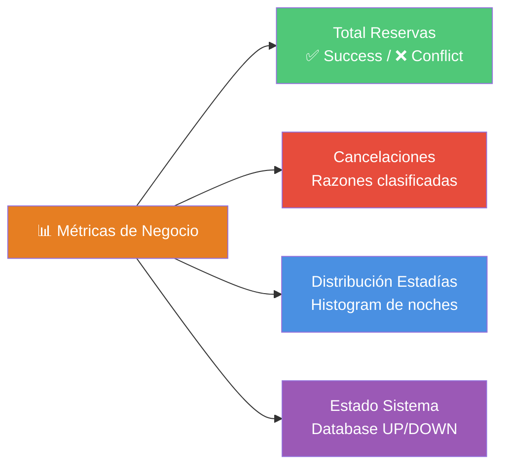
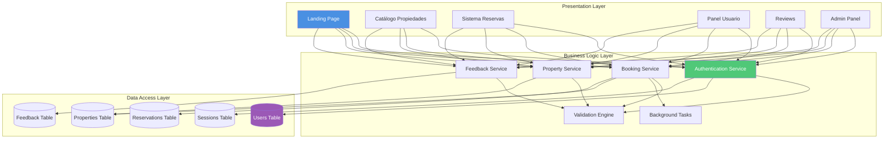
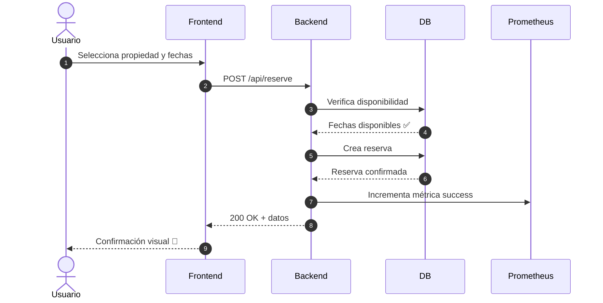
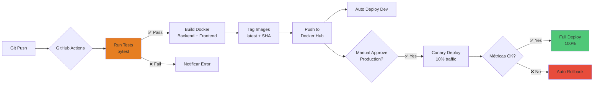
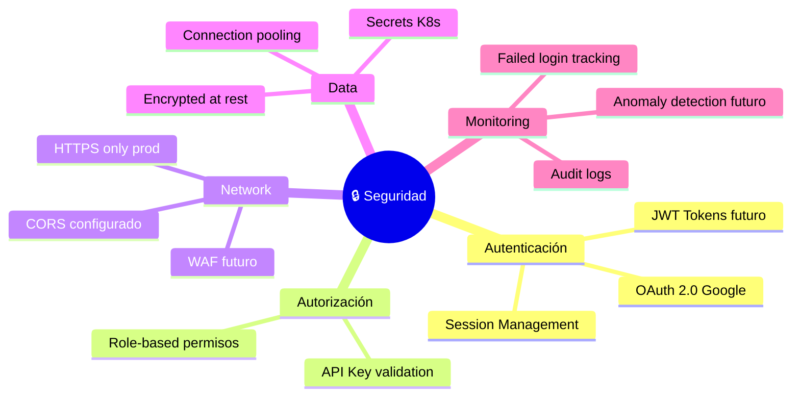
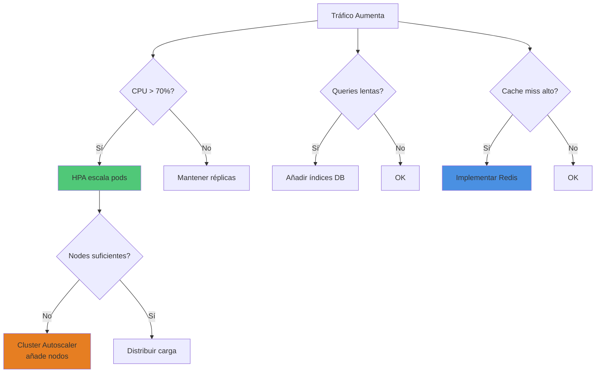
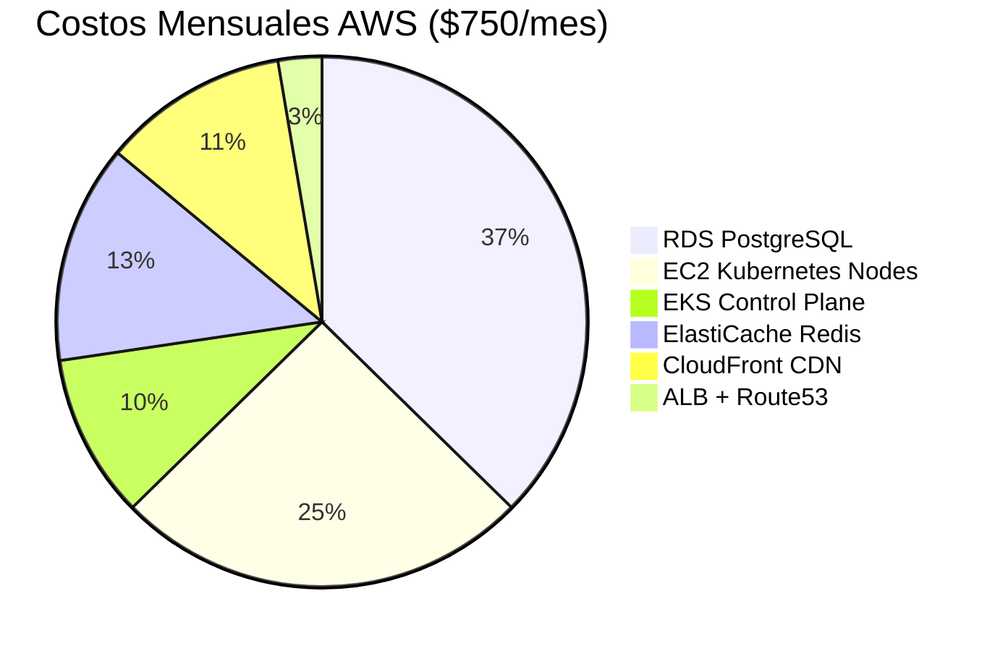

# 🎯 Resumen Ejecutivo de Arquitectura

> **Documento de referencia rápida para stakeholders técnicos y de negocio**

---

## 📊 Vista de Alto Nivel



---

## 🔑 Características Clave

| Categoría | Características |
|-----------|----------------|
| **🎨 Frontend** | 6 páginas HTML, TailwindCSS, Responsive design, SPA-like experience |
| **⚡ Backend** | FastAPI, Async I/O, OAuth 2.0, REST API, Background tasks |
| **🗄️ Database** | PostgreSQL 15 (prod), SQLite (dev), Connection pooling |
| **📊 Observability** | Prometheus metrics, Grafana dashboards, Custom business metrics |
| **🔐 Security** | OAuth Google, Session management, CORS, Secrets encryption |
| **🚀 Deployment** | Docker Compose, Kubernetes, GitHub Actions CI/CD |
| **📈 Scalability** | Horizontal scaling ready, HPA support, StatefulSet for DB |

---

## 💼 Métricas de Negocio

### KPIs Monitoreados en Tiempo Real



**Métricas expuestas**:
- `booking_reservations_total{outcome="success|conflict|invalid"}` - Counter
- `booking_cancellations_total{outcome="success|too_late"}` - Counter
- `booking_reservation_nights` - Histogram (distribución)
- `booking_database_up` - Gauge (0 o 1)

---

## 🏗️ Stack Tecnológico

### Backend
```
Python 3.11
├── FastAPI (Framework web moderno)
├── Uvicorn (ASGI server)
├── SQLAlchemy (ORM)
├── Pydantic (Validación de datos)
├── Authlib (OAuth 2.0)
├── Prometheus Client (Métricas)
└── Pytest (Testing)
```

### Frontend
```
HTML5 + CSS3 + JavaScript
├── TailwindCSS (Styling framework)
├── Fetch API (HTTP client)
└── Nginx (Web server)
```

### Infrastructure
```
Containerización: Docker
Orquestación: Kubernetes/Minikube
CI/CD: GitHub Actions
Registry: Docker Hub
Monitoring: Prometheus + Grafana
Database: PostgreSQL 15
```

---

## 🌐 Arquitectura de 3 Capas



---

## 🔄 Flujo de Usuario Principal

### Proceso de Reserva (Happy Path)



**Tiempo promedio**: < 200ms (p95)

---

## 📦 Entornos de Deployment

| Entorno | Infraestructura | Base de Datos | Réplicas | Costo/mes |
|---------|----------------|---------------|----------|-----------|
| **Desarrollo** | Docker Compose | SQLite / PostgreSQL | 1 de cada | $0 |
| **Testing** | Minikube (K8s) | PostgreSQL 15 | 1 de cada | $0 |
| **Producción** | EKS/GKE/AKS | RDS/Cloud SQL (Multi-AZ) | 5-20 (HPA) | ~$750 |

---

## 🚀 Pipeline CI/CD



**Tiempo de deployment**: ~5-10 minutos (dev) | ~15-20 minutos (prod)

---

## 🔒 Seguridad

### Capas de Seguridad Implementadas



---

## 📈 Escalabilidad y Rendimiento

### Capacidad Actual vs Objetivo

| Métrica | Desarrollo | Testing | Producción |
|---------|-----------|---------|------------|
| **Usuarios concurrentes** | 10 | 50 | 10,000+ |
| **Requests/segundo** | 10 | 50 | 1,000+ |
| **Latencia p95** | < 500ms | < 300ms | < 200ms |
| **Disponibilidad** | N/A | 95% | 99.9% |
| **Réplicas Backend** | 1 | 1 | 5-20 (HPA) |
| **DB Connections** | 5 | 20 | 100+ (pool) |

### Estrategias de Scaling



---

## 🎯 Roadmap Técnico

### Q1 2025
- [x] Arquitectura base con FastAPI + PostgreSQL
- [x] Frontend responsive con TailwindCSS
- [x] Observabilidad con Prometheus + Grafana
- [x] CI/CD con GitHub Actions
- [x] Deployment en Kubernetes

### Q2 2025 (Propuesto)
- [ ] Implementar Redis para caching
- [ ] Añadir Elasticsearch para búsqueda
- [ ] WebSockets para notificaciones en tiempo real
- [ ] Sistema de pagos (Stripe/PayPal)
- [ ] Email notifications (SendGrid)

### Q3 2025 (Propuesto)
- [ ] Migración a microservicios
- [ ] Service mesh (Istio)
- [ ] GraphQL API
- [ ] Mobile app (React Native)
- [ ] Machine Learning para recomendaciones

---

## 💰 Análisis de Costos (Producción)

### Breakdown Mensual (AWS)



### Optimizaciones de Costo Futuras
1. **Reserved Instances**: Ahorro 30-40%
2. **Spot Instances** para workers: Ahorro 60-70%
3. **Auto-scaling agresivo**: Reduce costos en horas valle
4. **CDN caching**: Reduce origen requests 80%

---

## 🎓 Decisiones de Arquitectura (ADRs)

### 1. FastAPI sobre Flask/Django
**Razón**: Performance async/await, documentación automática OpenAPI, type hints nativos

### 2. PostgreSQL sobre MongoDB
**Razón**: Transacciones ACID para reservas, relaciones claras, madurez del ecosistema

### 3. Kubernetes sobre Docker Compose en producción
**Razón**: Auto-healing, scaling horizontal, rolling updates, ecosystem maduro

### 4. Prometheus sobre otros sistemas de métricas
**Razón**: Estándar de facto, integración nativa con K8s, PromQL potente

### 5. TailwindCSS sobre Bootstrap
**Razón**: Utility-first, bundle size menor, customización más flexible

---

## 📞 Contactos del Proyecto

| Rol | Responsabilidad | Contacto |
|-----|----------------|----------|
| **Tech Lead** | Arquitectura y decisiones técnicas | tech-lead@proyecto.com |
| **DevOps Lead** | Infraestructura y deployments | devops@proyecto.com |
| **Product Owner** | Priorización de features | po@proyecto.com |
| **Security Officer** | Auditorías y compliance | security@proyecto.com |

---

## 📚 Recursos Adicionales

- [📖 Documentación Completa](./README.md)
- [🔄 Diagramas de Flujo](./ARCHITECTURE_FLOWS.md)
- [🌍 Guía de Deployment](./DEPLOYMENT_ENVIRONMENTS.md)
- [🐙 Repositorio GitHub](https://github.com/JULILYHERRERA/AIRBNB_GESTION)
- [🐋 Docker Hub Images](https://hub.docker.com/u/julilyherrera)

---

**Versión**: 1.1.0
**Última actualización**: 2025-11-11
**Estado**: ✅ En producción (Minikube) | 🚧 Cloud en desarrollo

---

<div align="center">

### 🎯 Construido con excelencia técnica


</div>
