# 🌍 Entornos de Deployment

## Diagrama de Entornos


---

## Comparación de Entornos

| Característica | Desarrollo Local | Testing/Minikube | Producción (Futuro) |
|----------------|------------------|------------------|---------------------|
| **Orquestador** | Docker Compose | Kubernetes (Minikube) | Kubernetes (EKS/GKE/AKS) |
| **Base de Datos** | SQLite / PostgreSQL | PostgreSQL 15 | Cloud Managed DB |
| **Replicas Frontend** | 1 | 1 | 3+ (HPA) |
| **Replicas Backend** | 1 | 1 | 5+ (HPA) |
| **Dominio** | localhost | localhost | Custom domain + SSL |
| **Monitoreo** | Prometheus + Grafana | Prometheus + Grafana | Full observability stack |
| **Logs** | Docker logs | kubectl logs | ELK/Loki + Grafana |
| **Secrets** | .env file | Kubernetes Secrets | Vault / Cloud KMS |
| **Backup DB** | Manual | Manual snapshots | Automated daily backups |
| **HA** | No | No | Multi-AZ deployment |
| **Auto-scaling** | No | No | HPA + Cluster Autoscaler |
| **CDN** | No | No | CloudFlare |
| **SSL/TLS** | No | No (opcional) | Let's Encrypt / ACM |
| **Cache** | No | No | Redis Cluster |
| **Session Store** | In-memory | In-memory | Redis |
| **Costo** | $0 | $0 | $$$$ |

---

## Configuración por Entorno

### 🔵 Desarrollo Local

**Archivo**: `docker-compose.yml`

```yaml
# Variables de entorno para desarrollo
environment:
  - DATABASE_URL=sqlite:///app.db  # O PostgreSQL local
  - DEBUG=true
  - LOG_LEVEL=DEBUG
  - GOOGLE_CLIENT_ID=${GOOGLE_CLIENT_ID}
  - GOOGLE_CLIENT_SECRET=${GOOGLE_CLIENT_SECRET}
  - FRONTEND_BASE_URL=http://localhost:80

# Características
- Hot reload activado
- Logs verbosos
- Sin límites de recursos
- Volúmenes montados para desarrollo
- Acceso directo a servicios
```

**Comandos**:
```bash
# Iniciar todos los servicios
docker compose up --build

# Solo backend y base de datos
docker compose up backend db

# Ver logs
docker compose logs -f backend

# Acceso
# Frontend: http://localhost:80
# Backend API: http://localhost:8000
# Swagger Docs: http://localhost:8000/docs
# Prometheus: http://localhost:9090
# Grafana: http://localhost:3000
```

---

### 🟢 Testing / Minikube

**Archivos**:
- `deployment.yaml`
- `service.yaml`
- `configmap.yaml`
- `secret.yaml`

```yaml
# ConfigMap
apiVersion: v1
kind: ConfigMap
metadata:
  name: airbnb-config
data:
  POSTGRES_DB: booking_app_db
  POSTGRES_USER: user_fastapi
  POSTGRES_HOST: postgres-service
  POSTGRES_PORT: "5432"
  LOG_LEVEL: INFO

# Secret (base64 encoded)
apiVersion: v1
kind: Secret
metadata:
  name: airbnb-secret
type: Opaque
stringData:
  POSTGRES_PASSWORD: "mysecretpassword"
  GOOGLE_CLIENT_ID: "your-client-id"
  GOOGLE_CLIENT_SECRET: "your-client-secret"
```

**Características**:
- Réplicas configurables
- Health checks (liveness/readiness)
- Resource limits definidos
- Init containers para dependencias
- Services ClusterIP/NodePort
- Persistent volumes

**Comandos**:
```bash
# Iniciar Minikube
minikube start --driver=docker

# Aplicar configuración
kubectl apply -f configmap.yaml
kubectl apply -f secret.yaml
kubectl apply -f service.yaml
kubectl apply -f deployment.yaml

# Ver recursos
kubectl get pods
kubectl get services
kubectl get pvc

# Port forwarding
kubectl port-forward svc/frontend-service 8080:80
kubectl port-forward svc/backend-service 8000:8000

# Ver logs
kubectl logs -f deployment/backend
kubectl logs -f deployment/frontend

# Acceso
# Frontend: http://localhost:8080
# Backend: http://localhost:8000
```

---

### 🟠 Producción (Cloud - Propuesta)

**Infraestructura como Código** (Terraform/Pulumi)

```hcl
# terraform/main.tf
resource "aws_eks_cluster" "airbnb_cluster" {
  name     = "airbnb-production"
  role_arn = aws_iam_role.eks_cluster.arn
  version  = "1.28"

  vpc_config {
    subnet_ids = aws_subnet.private[*].id
  }
}

resource "aws_rds_instance" "postgres" {
  identifier           = "airbnb-postgres-prod"
  engine              = "postgres"
  engine_version      = "15.4"
  instance_class      = "db.t3.large"
  allocated_storage   = 100
  storage_encrypted   = true
  multi_az           = true
  backup_retention_period = 30

  db_subnet_group_name = aws_db_subnet_group.postgres.name
  vpc_security_group_ids = [aws_security_group.rds.id]
}

resource "aws_elasticache_cluster" "redis" {
  cluster_id           = "airbnb-redis-prod"
  engine              = "redis"
  node_type           = "cache.t3.medium"
  num_cache_nodes     = 2
  parameter_group_name = "default.redis7"
}
```

**Kubernetes Manifests (Producción)**

```yaml
# production/backend-deployment.yaml
apiVersion: apps/v1
kind: Deployment
metadata:
  name: backend
  namespace: production
spec:
  replicas: 5
  strategy:
    type: RollingUpdate
    rollingUpdate:
      maxSurge: 2
      maxUnavailable: 1

  template:
    spec:
      containers:
      - name: backend
        image: julilyherrera/airbnb-backend:v1.1
        resources:
          requests:
            memory: "512Mi"
            cpu: "500m"
          limits:
            memory: "1Gi"
            cpu: "1000m"

        env:
        - name: DATABASE_URL
          valueFrom:
            secretKeyRef:
              name: rds-credentials
              key: url
        - name: REDIS_URL
          valueFrom:
            secretKeyRef:
              name: redis-credentials
              key: url
        - name: LOG_LEVEL
          value: "INFO"

---
# HPA para auto-scaling
apiVersion: autoscaling/v2
kind: HorizontalPodAutoscaler
metadata:
  name: backend-hpa
  namespace: production
spec:
  scaleTargetRef:
    apiVersion: apps/v1
    kind: Deployment
    name: backend
  minReplicas: 5
  maxReplicas: 20
  metrics:
  - type: Resource
    resource:
      name: cpu
      target:
        type: Utilization
        averageUtilization: 70
  - type: Resource
    resource:
      name: memory
      target:
        type: Utilization
        averageUtilization: 80

---
# Ingress con TLS
apiVersion: networking.k8s.io/v1
kind: Ingress
metadata:
  name: airbnb-ingress
  namespace: production
  annotations:
    cert-manager.io/cluster-issuer: "letsencrypt-prod"
    nginx.ingress.kubernetes.io/ssl-redirect: "true"
spec:
  ingressClassName: nginx
  tls:
  - hosts:
    - www.airbnb-clone.com
    - api.airbnb-clone.com
    secretName: airbnb-tls-cert
  rules:
  - host: www.airbnb-clone.com
    http:
      paths:
      - path: /
        pathType: Prefix
        backend:
          service:
            name: frontend-service
            port:
              number: 80
  - host: api.airbnb-clone.com
    http:
      paths:
      - path: /
        pathType: Prefix
        backend:
          service:
            name: backend-service
            port:
              number: 8000
```

**Características de Producción**:
- Multi-AZ deployment para alta disponibilidad
- Database managed (AWS RDS, GCP Cloud SQL)
- Redis cluster para sessions y cache
- Auto-scaling basado en CPU/memoria
- SSL/TLS automático con cert-manager
- CDN para assets estáticos
- WAF para seguridad
- Backups automáticos diarios
- Disaster recovery plan
- Blue-green deployments
- Canary releases

**Costos estimados mensuales** (AWS):
| Servicio | Instancia | Costo/mes |
|----------|-----------|-----------|
| EKS Control Plane | 1 cluster | $75 |
| EC2 Nodes | 3x t3.large | $190 |
| RDS PostgreSQL | db.t3.large Multi-AZ | $280 |
| ElastiCache Redis | 2x cache.t3.medium | $100 |
| Application Load Balancer | 1 ALB | $20 |
| CloudFront CDN | 1TB transfer | $85 |
| Route53 | Hosted zone | $0.50 |
| **Total estimado** | | **~$750/mes** |

---

## Pipeline de Deployment

```mermaid
graph LR
    Dev[Developer] -->|git push| GitHub[GitHub]
    GitHub -->|Webhook| Actions[GitHub Actions]

    Actions --> Test[Run Tests<br/>pytest]
    Test -->|✅ Pass| Build[Build Docker Images]
    Test -->|❌ Fail| Notify1[Notify Developer]

    Build --> Tag[Tag Images<br/>SHA + latest]
    Tag --> Push[Push to Docker Hub]

    Push --> DeployDev{Auto Deploy<br/>to Dev?}
    DeployDev -->|Yes| UpdateDev[Update Dev Compose]

    Push --> DeployTest{Deploy to<br/>Minikube?}
    DeployTest -->|Manual Approval| UpdateK8sDev[kubectl apply]

    Push --> DeployProd{Deploy to<br/>Production?}
    DeployProd -->|Manual Approval + Review| UpdateK8sProd[kubectl apply]
    UpdateK8sProd --> Canary[Canary Deployment<br/>10% traffic]
    Canary --> Monitor{Metrics OK?}

    Monitor -->|✅ Yes| FullDeploy[Full Deployment<br/>100% traffic]
    Monitor -->|❌ No| Rollback[Automatic Rollback]

    FullDeploy --> Success[🎉 Deployment Success]
    Rollback --> Notify2[Notify DevOps]

    style Test fill:#E67E22
    style Success fill:#50C878
    style Rollback fill:#E74C3C
```



---

## Estrategia de Rollback

### Desarrollo Local
```bash
# Volver a commit anterior
git checkout <commit-hash>
docker compose down
docker compose up --build
```

### Minikube
```bash
# Volver a deployment anterior
kubectl rollout undo deployment/backend

# Volver a versión específica
kubectl rollout undo deployment/backend --to-revision=2

# Ver historial
kubectl rollout history deployment/backend
```

### Producción
```bash
# Rollback automático en caso de falla
kubectl rollout undo deployment/backend -n production

# Deployment canary - gradual rollout
kubectl patch deployment backend -n production \
  -p '{"spec":{"replicas":1}}' # 1 pod con nueva versión

# Monitorear métricas
# Si error_rate > 1% o latency_p95 > 500ms -> rollback

# Rollback completo
kubectl rollout undo deployment/backend -n production
```

---

## Checklist de Pre-Deployment

### ✅ Desarrollo
- [ ] Código revisado y aprobado
- [ ] Tests unitarios pasan localmente
- [ ] Docker Compose funciona sin errores
- [ ] No hay credenciales hardcodeadas
- [ ] Logs no contienen información sensible

### ✅ Testing/Minikube
- [ ] CI/CD pipeline pasa todas las pruebas
- [ ] Imágenes Docker construidas exitosamente
- [ ] ConfigMaps y Secrets actualizados
- [ ] Health checks configurados
- [ ] Resource limits definidos
- [ ] Port forwarding funciona correctamente

### ✅ Producción
- [ ] Backup de base de datos realizado
- [ ] Blue-green deployment configurado
- [ ] Monitoreo y alertas activas
- [ ] Documentación actualizada
- [ ] Plan de rollback documentado
- [ ] Comunicación a stakeholders enviada
- [ ] Ventana de mantenimiento programada
- [ ] Equipo de soporte en standby
- [ ] Load testing completado
- [ ] Security scan passed
- [ ] Performance benchmarks verificados

---

**Última actualización**: 2025-11-11
