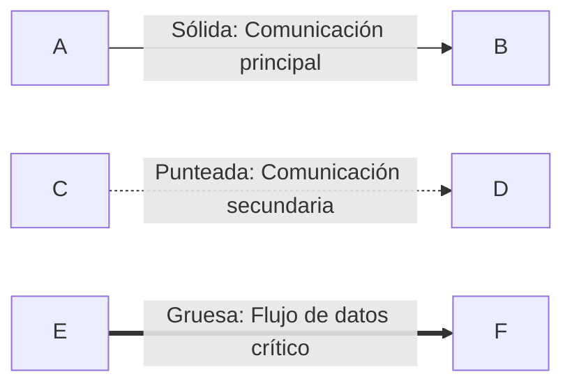

# 📚 Documentación de Arquitectura

Bienvenido a la documentación técnica completa de la **Plataforma de Reservas de Propiedades**.

## 📖 Índice de Documentos

### 1. 🏗️ [ARCHITECTURE.md](../ARCHITECTURE.md)
**Diagrama de Arquitectura Principal**

Documento central que contiene:
- Diagrama completo de la arquitectura del sistema
- Descripción detallada de todos los componentes
- Capas de la aplicación (Frontend, Backend, Data, Observability, Infrastructure)
- Stack tecnológico completo
- Métricas de observabilidad
- Configuración de seguridad

**📌 Comienza aquí si es tu primera vez explorando el proyecto.**

---

### 2. 🔄 [ARCHITECTURE_FLOWS.md](./ARCHITECTURE_FLOWS.md)
**Diagramas de Flujo y Secuencia**

Incluye:
- Diagramas de secuencia detallados:
  - Flujo de reserva de propiedades
  - Autenticación OAuth con Google
  - Monitoreo y observabilidad
- Diagramas de flujo:
  - Proceso de deployment CI/CD
  - Estados del ciclo de vida de reservas
- Topología de red Kubernetes
- Modelos C4 (Contexto y Componentes)
- Métricas de rendimiento objetivo
- Estrategias de escalabilidad

**📌 Lee este documento para entender cómo fluyen los datos y las interacciones entre componentes.**

---

### 3. 🌍 [DEPLOYMENT_ENVIRONMENTS.md](./DEPLOYMENT_ENVIRONMENTS.md)
**Configuración de Entornos**

Cubre:
- Comparación de entornos (Desarrollo, Testing, Producción)
- Configuración específica por entorno
- Variables de entorno y secrets
- Comandos de deployment
- Pipeline de CI/CD completo
- Estrategias de rollback
- Costos estimados de infraestructura cloud
- Checklist de pre-deployment

**📌 Consulta este documento cuando necesites deployar o configurar un entorno.**

---

## 🎯 Guías de Lectura por Rol

### 👨‍💻 **Developer / Ingeniero de Software**
1. Comienza con [ARCHITECTURE.md](../ARCHITECTURE.md) para entender la estructura general
2. Revisa [ARCHITECTURE_FLOWS.md](./ARCHITECTURE_FLOWS.md) para entender los flujos de negocio
3. Consulta [DEPLOYMENT_ENVIRONMENTS.md](./DEPLOYMENT_ENVIRONMENTS.md) sección "Desarrollo Local"

**Archivos de código relevantes**:
- `backend/main.py` - Aplicación FastAPI principal
- `frontend/*.html` - Vistas del frontend
- `docker-compose.yml` - Orquestación local

---

### 👨‍💼 **DevOps / SRE**
1. Lee [DEPLOYMENT_ENVIRONMENTS.md](./DEPLOYMENT_ENVIRONMENTS.md) completo
2. Estudia [ARCHITECTURE.md](../ARCHITECTURE.md) sección "Infraestructura"
3. Revisa [ARCHITECTURE_FLOWS.md](./ARCHITECTURE_FLOWS.md) sección "Monitoreo y Observabilidad"

**Archivos de infra relevantes**:
- `deployment.yaml` - Manifests de Kubernetes
- `service.yaml` - Services de K8s
- `monitoring/prometheus/prometheus.yml` - Configuración Prometheus
- `monitoring/grafana/` - Dashboards de Grafana

---

### 🏗️ **Arquitecto de Software**
Lee todos los documentos en orden:
1. [ARCHITECTURE.md](../ARCHITECTURE.md) - Visión general
2. [ARCHITECTURE_FLOWS.md](./ARCHITECTURE_FLOWS.md) - Interacciones detalladas
3. [DEPLOYMENT_ENVIRONMENTS.md](./DEPLOYMENT_ENVIRONMENTS.md) - Estrategias de deployment

**Enfócate en**:
- Patrones de diseño utilizados
- Escalabilidad horizontal y vertical
- Trade-offs de arquitectura
- Estrategias de caching (futuro)
- Alta disponibilidad (producción)

---

### 🔒 **Security Engineer**
1. [ARCHITECTURE.md](../ARCHITECTURE.md) sección "Seguridad"
2. [DEPLOYMENT_ENVIRONMENTS.md](./DEPLOYMENT_ENVIRONMENTS.md) - Configuración de Secrets
3. [ARCHITECTURE_FLOWS.md](./ARCHITECTURE_FLOWS.md) - Flujo OAuth

**Áreas de enfoque**:
- Gestión de secrets (Kubernetes Secrets, futuro: Vault)
- OAuth 2.0 implementation
- CORS configuration
- Network policies (producción)
- WAF y DDoS protection (producción)

---

### 📊 **Product Manager / Business Analyst**
1. [ARCHITECTURE.md](../ARCHITECTURE.md) sección "Funcionalidades"
2. [ARCHITECTURE_FLOWS.md](./ARCHITECTURE_FLOWS.md) - Diagramas de estados
3. [DEPLOYMENT_ENVIRONMENTS.md](./DEPLOYMENT_ENVIRONMENTS.md) sección "Costos"

**Métricas de negocio**:
- `booking_reservations_total` - Total de reservas
- `booking_cancellations_total` - Cancelaciones
- `booking_reservation_nights` - Distribución de estadías
- User journey flows

---

## 🔍 Búsqueda Rápida

### ¿Cómo hacer...?

| Pregunta | Documento | Sección |
|----------|-----------|---------|
| ¿Cómo levantar el proyecto localmente? | [DEPLOYMENT_ENVIRONMENTS.md](./DEPLOYMENT_ENVIRONMENTS.md) | Desarrollo Local |
| ¿Qué endpoints expone la API? | [ARCHITECTURE.md](../ARCHITECTURE.md) | Backend Layer |
| ¿Cómo funciona el flujo de reserva? | [ARCHITECTURE_FLOWS.md](./ARCHITECTURE_FLOWS.md) | Diagrama de Secuencia |
| ¿Qué métricas se recolectan? | [ARCHITECTURE.md](../ARCHITECTURE.md) | Observability |
| ¿Cómo deployar a Kubernetes? | [DEPLOYMENT_ENVIRONMENTS.md](./DEPLOYMENT_ENVIRONMENTS.md) | Testing/Minikube |
| ¿Cuánto cuesta en producción? | [DEPLOYMENT_ENVIRONMENTS.md](./DEPLOYMENT_ENVIRONMENTS.md) | Costos estimados |
| ¿Cómo hacer rollback? | [DEPLOYMENT_ENVIRONMENTS.md](./DEPLOYMENT_ENVIRONMENTS.md) | Estrategia de Rollback |
| ¿Cómo escalar horizontalmente? | [ARCHITECTURE_FLOWS.md](./ARCHITECTURE_FLOWS.md) | Estrategias de Escalabilidad |

---

## 📐 Convenciones de Diagramas

### Colores utilizados en Mermaid

| Color | Uso | Componente |
|-------|-----|------------|
| 🔵 Azul (`#4A90E2`) | Frontend Layer | Nginx, HTML pages |
| 🟢 Verde (`#50C878`) | Backend Layer | FastAPI, Python services |
| 🟣 Púrpura (`#9B59B6`) | Data Layer | PostgreSQL, SQLite |
| 🟠 Naranja (`#E67E22`) | Observability | Prometheus, Grafana |
| ⚫ Gris (`#34495E`) | Infrastructure | Docker, Kubernetes |
| 🔴 Rojo (`#E74C3C`) | External Services | Google OAuth, Docker Hub |

### Tipos de líneas

---

## 🛠️ Herramientas para Visualizar Diagramas

### En GitHub
Los diagramas Mermaid se renderizan automáticamente al visualizar los archivos `.md` en GitHub.

### Localmente

#### VS Code
1. Instala extensión: **Markdown Preview Mermaid Support**
2. Abre cualquier archivo `.md`
3. `Ctrl/Cmd + Shift + V` para preview

#### IntelliJ / PyCharm
1. Usa el plugin **Mermaid**
2. Preview automático en archivos Markdown

#### Online
- [Mermaid Live Editor](https://mermaid.live/)
- Copia y pega el código Mermaid para editar/exportar

---

## 📝 Mantenimiento de Documentación

### Política de Actualización

| Evento | Documentos a Actualizar |
|--------|------------------------|
| **Nuevo componente añadido** | ARCHITECTURE.md + ARCHITECTURE_FLOWS.md |
| **Cambio en flujo de negocio** | ARCHITECTURE_FLOWS.md |
| **Nuevo entorno de deployment** | DEPLOYMENT_ENVIRONMENTS.md |
| **Nueva métrica de observabilidad** | ARCHITECTURE.md + ARCHITECTURE_FLOWS.md |
| **Cambio en tecnología** | ARCHITECTURE.md (Stack tecnológico) |

### Versionado
- Cada documento incluye **Última actualización** en el footer
- Versión de arquitectura sigue [Semantic Versioning](https://semver.org/)
- Cambios mayores incrementan versión principal (v1.x → v2.0)

---

## 📊 Métricas de Documentación

### Coverage
- ✅ Arquitectura general: 100%
- ✅ Flujos de negocio principales: 100%
- ✅ Deployment local y K8s: 100%
- ⚠️ Deployment producción cloud: 70% (propuesta, no implementado)
- ⚠️ Disaster recovery: 50% (parcial)

### Completitud por Audiencia
- ✅ Developers: 100%
- ✅ DevOps: 95%
- ✅ Arquitectos: 100%
- ✅ Security: 80%
- ✅ Product: 90%

---

## 🤝 Contribuciones a la Documentación

Si encuentras errores o quieres mejorar la documentación:

1. Crea un issue describiendo el problema/mejora
2. Fork el repositorio
3. Actualiza los documentos relevantes
4. Asegúrate de que los diagramas Mermaid sean válidos
5. Actualiza la fecha de "Última actualización"
6. Crea un Pull Request

### Checklist PR para Docs
- [ ] Diagramas Mermaid validan en [Mermaid Live](https://mermaid.live/)
- [ ] Gramática y ortografía revisadas
- [ ] Links internos funcionan correctamente
- [ ] Screenshots actualizadas (si aplica)
- [ ] Fecha de actualización modificada

---

## 📞 Contacto y Soporte

- **Repository**: [JULILYHERRERA/AIRBNB_GESTION](https://github.com/JULILYHERRERA/AIRBNB_GESTION)
- **Issues**: [GitHub Issues](https://github.com/JULILYHERRERA/AIRBNB_GESTION/issues)
- **Discussions**: [GitHub Discussions](https://github.com/JULILYHERRERA/AIRBNB_GESTION/discussions)

---

## 📜 Licencia

Este proyecto y su documentación están bajo la licencia especificada en [LICENSE.txt](../LICENSE.txt).

---

**Última actualización**: 2025-11-11
**Versión de documentación**: 1.0.0
**Mantenedor**: Equipo de Desarrollo Airbnb Clone
